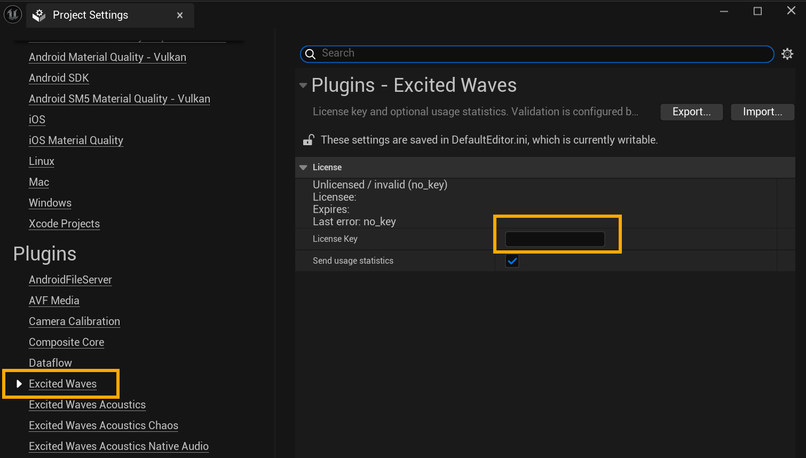

# Excited Waves Acoustics – UE Native Audio Integration

**Unreal Engine 5.6.1 · Win64 · Beta**

<https://excitedwaves.com> · <contact@excitedwaves.com>

---

Excited Waves Acoustics is a runtime acoustics SDK. It analyzes geometry around every sound source with optimized raycasting and automatically drives reverbs and early reflections. No baking or manual authoring is needed.

This repository is a **UE 5.6.1 integration demo project** that bundles three plugins on the **Native UE Audio** path:

| Plugin | Role |
|--------|------|
| [`ExcitedWavesAcoustics`](Plugins/ExcitedWavesAcoustics/) | Core detection SDK. |
| [`ExcitedWavesAcousticsNativeAudio`](Plugins/ExcitedWavesAcousticsNative/) | Native UE Audio adapter. Drives reverb via UE Submixes and early reflections via custom DSP: `USubmixEffectExcitedWavesEarlyReflectionsPreset`. |
| [`ExcitedWavesAcousticsChaos`](Plugins/ExcitedWavesAcousticsChaos/) | Chaos Destruction integration. Auto-detects destroyed geometry and triggers re-scans. |

## Quick Start

> [!WARNING]
> A trial license key is required. Without it the acoustics will not work.
>
> Request one at contact@excitedwaves.com and enter it in **Project Settings > Plugins > Excited Waves Acoustics**.

1. Open `EWANative.uproject` in Unreal Editor 5.6.1 – the level `EWDemo.umap` is already loaded
2. Press **Play** and move around. Runtime hotkeys:
   | Key | Action |
   |-----|--------|
   | `0` | Toggle system on/off |
   | `1` | Show results above nearby emitters |
   | `2` | Show rays |
   | `3` | Show hit points |
   | `4` | Show detector positions |
   | `5` | Dry-to-reverb ratio drive |
   | `6` | Cross-room on/off |
   | `M` | Solo reverbs on/off |
3. To integrate into your own project, follow the docs: [Unreal Engine — Native Audio](https://excitedwaves.gitbook.io/excitedwaves-docs/unreal-engine-native-audio)

## What's What

| You want to | Read |
|-------------|------|
| Understand how it works | [Overview](https://excitedwaves.gitbook.io/excitedwaves-docs) |
| Quick Start | [Quick Start](https://excitedwaves.gitbook.io/excitedwaves-docs/quick-start-guide#first-setup) |
| Set up native audio | [Native Audio Integration](https://excitedwaves.gitbook.io/excitedwaves-docs/unreal-engine-native-audio) |
| Core Settings | [Core Settings](https://excitedwaves.gitbook.io/excitedwaves-docs/core-settings) |

## License

This repository contains a trial build for evaluation only.
A trial key is required to run the software.
Request one at contact@excitedwaves.com

Commercial use requires a separate license.
